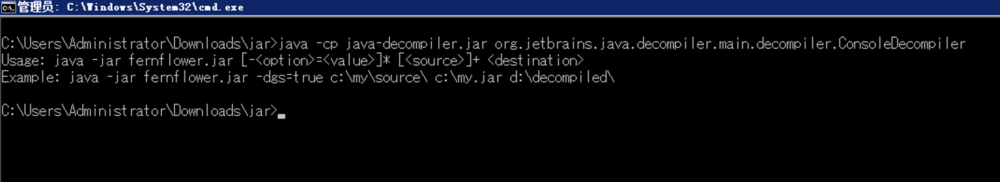

# Decompiler_Tools

# 0x01 default idea decompiler

## Mac OS Dir

`/Applications/IntelliJ IDEA.app/Contents/plugins/java-decompiler/lib`


```
/Applications/IntelliJ IDEA.app/Contents/plugins/java-decompiler/lib

-rw-r--r--@ 1 xxx  xxx   1.4M  4  8 22:19 java-decompiler.jar

java-decompiler.jar: Java archive data (JAR)

```

## Windows OS Dir

```

```

#0x02 usage:


```
java -cp java-decompiler.jar org.jetbrains.java.decompiler.main.decompiler.ConsoleDecompiler

Usage: java -jar fernflower.jar [-<option>=<value>]* [<source>]+ <destination>
Example: java -jar fernflower.jar -dgs=true c:\my\source\ c:\my.jar d:\decompiled\

```

## Set Bat

`java -cp java-decompiler.jar org.jetbrains.java.decompiler.main.decompiler.ConsoleDecompiler -dgs=true %1 %2`

`1.bat xxxx.jar decompiled`

decompiled 目录得到一个jar，然后修改后缀为zip等格式，解压缩得到java文件源代码。

